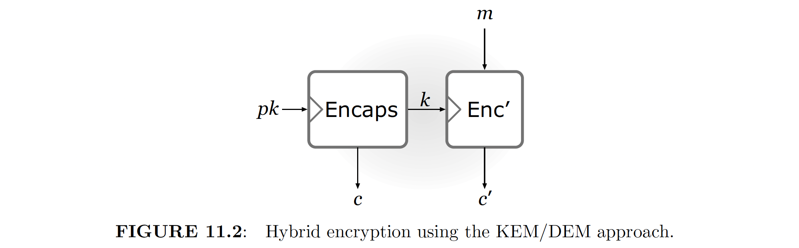
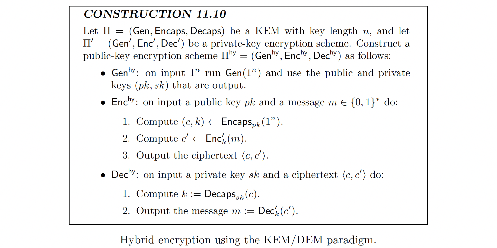

# 😈 Post-Quantum Cryptography for Web3

As Marilyn Monroe once sang:
> *Every baby needs a da-da-daddy*\
> *To keep her worry free*\
> *Rich or poor I don't care who*\
> *If he hasn't got a million then a half will do* 💸

This repository helps you to become your own da-da-daddy, to keep you worry free of hacking on your account while transfering coins on blockchains.

Technically, this package constructs hybrid encryption for private keys with the KEM (Key Encapsulation Mechanism) paradigm, which is proved to be post-quantum safe. This README file is organized as follows:
- [KEM Illustrations](#-kem-illustrations)
- [High Level Goal](#-high-level-goal)
- [Instructions](#-instructions)
- [Requirements](#-requirements)
- [Configure Your Own Testnet](#-configure-your-own-testnet)

## 🕹 KEM Illustrations


<!-- The key pair generation are run only once, and we assume that the secret key is stored securely by the receiver. -->
<!-- We assume that the channel is unsafe. -->
<!-- Suppose that if there is no EMS and we directly transmit the key, then this key may be intercepted and be used to decrypt the message. -->
<!-- Thus, KEM is introduced. In this case, only the ciphertext is transmitted (assuming that the secret key is pre-saved by the receiver). -->
<!-- Even if the attacker intercepts the ciphertext, he will not be able to guess even a bit for the key, which is used to encode the message. -->

## 🕹 High-Level Goal
### Privacy Protection on Blockchain
```python
# Relationship of private key and address
hash(hash(fun(private_key🔑))) -> address🏠

# Encryption for the transaction
hash({'payer address': payer_address🏠,
      'receiver address': receiver_address🏠,
      'amount': '0.1wei'})   
-> transaction_info🧾

# Sign the transaction info
sign(transaction_info🧾, private_key🔑) -> signature🖍

# Verify the signature
verify(signature🖍, receiver_address🏠) -> transaction_info🧾
```
### Key Encryption with Post-Quantum Cryptography
```python
# Encrypt and decrypt by PQC
# We obtain the ciphertext by KEM
public_key💉, secret_key🧬 = KEM.generate_keypair()
ciphertext📜, key💊 = KEM.encapsulate(public_key💉)

# Notice that all symmetric encryption is quantum safe
# User will hold a PQC ciphertext encrypted key which we provide
encrypt_symmetric(private_key🔑, key💊) = private_key_encrypted🔐

# We can convert the user-hold key to the private key by the ciphertext
key💊 = KEM.decapsulate(secret_key🧬, ciphertext📜)
decrypt_symmetric(private_key_encrypted🔐, key💊) = private_key🔑
```

## 🕹 Instructions
The codes are structured as follows:
- [`demo.ipynb`](https://github.com/ZIYU-DEEP/post-quantum-crypto-for-blockchains/blob/main/demo.ipynb): If you are just looking for one file demonstrating all, this is what you need.
- [`qure.py`](https://github.com/ZIYU-DEEP/post-quantum-crypto-for-blockchains/blob/main/encryption.py): This file can be seen as a package providing encryption and decryption functions using KEM (Key Encapsulation Mechanism) and SKE (Symmetric Key Encryption).
- [`encryption.py`](https://github.com/ZIYU-DEEP/post-quantum-crypto-for-blockchains/blob/main/encryption.py): Given the `user_id` and the user specified `private_key`, this file runs an KEM + SKE protocol. The encrypted information are stored in [json](https://github.com/ZIYU-DEEP/post-quantum-crypto-for-blockchains/blob/main/database/leviathan/0.json) in our [database](https://github.com/ZIYU-DEEP/post-quantum-crypto-for-blockchains/tree/main/database/), while user can hold an abstract of the information in another [local json file](https://github.com/ZIYU-DEEP/post-quantum-crypto-for-blockchains/blob/main/database/leviathan/0_local.json), containing `user_id`, `key_id`, `kem_algo`, and `ciphertext_abs`.
- [`transaction.py`](https://github.com/ZIYU-DEEP/post-quantum-crypto-for-blockchains/blob/main/transaction.py): This file implements the transaction, while the user only need to provide the information in the aforementioned [local json file](https://github.com/ZIYU-DEEP/post-quantum-crypto-for-blockchains/blob/main/database/leviathan/0_local.json). The true private key is never transmitted.

Those example commands are tested with Python 3.8 (see requirements in the next section).
```bash
# Clone the repository
git clone git@github.com:ZIYU-DEEP/post-quantum-crypto-for-blockchains.git
cd post-quantum-crypto-for-blockchains

# Test the compatibility of the code on your device
# You should be able to see new json files created under ./database/leviathan/
python encryption.py

# Encrypt your private key in our database
python encryption.py --user_id leviathan\
                     --private_key 217d5c81a38240e09ee05bc4ab3efce2eb91d24973162f9833ed18aa7b4460b9\
                     --kem_algo Kyber512\
                     --root ./database

# Make encrypted transaction with your information
python request.py --user_id leviathan\
                  --key_id 0\
                  --ciphertext_abs 7f9da539c7ca9cbab104cb2a76d93be0\
                  --url https://eth-goerli.g.alchemy.com/v2/fss_yq1JH8COJapGjbQCuaCD77JrjQRp\
                  --chain_id 5\
                  --account_from 0xA5b372E60a60A70f2c6ACB87710eba30Ecc4D479\
                  --account_to 0xA059250F4b97bbB3C081f6D9e1fC7249c6Ea2A0c\
                  --value 0.0001\
                  --gas 21000\
                  --gas_price 200000000\
                  --root ./database
```
The command line operations above are also implemented in [`demo.ipynb`](https://github.com/ZIYU-DEEP/post-quantum-crypto-for-blockchains/blob/main/demo.ipynb) through IPython interations. Notice that the credentials (e.g., `url`, `private_key`, `account_from`, `account_to`) value provided in the arguments are just for illustration use; you should replace it with your own credentials or create a test profile (see the section on [configuring the testnet](#-configure-your-own-testnet)).

## 🕹 Requirements
```bash
web3==5.30.0
ecdsa==0.18.0
cryptography==37.0.4
liboqs-python==0.7.2  # see instructions below
```
### Installation for `liboqs-python`
The following commands are tested on MacOS Catalina with Python 3.8.
```bash
# Build liboqs from source
>>> cd ~
>>> brew install cmake ninja openssl@1.1 wget doxygen graphviz astyle valgrind
>>> pip install pytest pytest-xdist pyyaml nose nose2 rednose
>>> git clone -b main https://github.com/open-quantum-safe/liboqs.git
>>> cd liboqs && mkdir build && cd build
>>> cmake -GNinja .. -DBUILD_SHARED_LIBS=ON
>>> ninja
>>> sudo ninja install
>>> export LD_LIBRARY_PATH=$LD_LIBRARY_PATH:/usr/local/lib

# Build the Python wrapper
>>> cd ~ && git clone git@github.com:open-quantum-safe/liboqs-python.git
>>> cd ~/liboqs-python
>>> python setup.py install
>>> export PYTHONPATH=~/liboqs-python

# Check if the installation is successful
>>> python tests/test_sig.py
```

## 🕹 Configure Your Own Testnet
You may test the efficacy of the encryption using a testnet (instead of the main ETH chain) first. Here is a quick intro for testnet configuration.
1. Register an [Alchemy account](https://www.alchemy.com/).
2. Follow the [instruction](https://docs.alchemy.com/docs/alchemy-quickstart-guide) to create an [new Alchemy App](https://dashboard.alchemy.com/apps) and get an API key. For test, simply select Etherum as the chain and Goerili as the network.
3. Create an [Metamask](https://metamask.io/) profile for your wallet.
4. Manually add a network on Metamask (see the [instruction](https://docs.alchemy.com/docs/how-to-add-alchemy-rpc-endpoints-to-metamask)). The PRC url is simply the HTTPS link of your new Alchemy App (press the "view key" button on the App dashboard to find it.)
5. Add money to your Metamask wallet account from this [link](https://goerlifaucet.com/) if your are using Goerili.
6. You are now ready to grab your information and make transactions.

## 🕹 References
[1] Katz, Jonathan, and Yehuda Lindell. [*Introduction to Modern Cryptography*](http://library.lol/main/E59B838EB90F79A638831BEDCEAA5179). CRC press, 2020.
