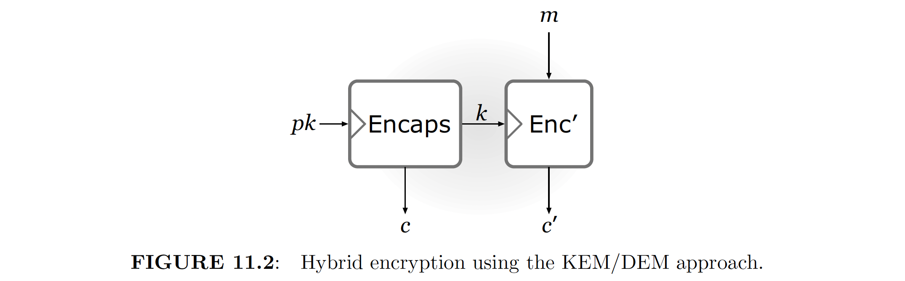
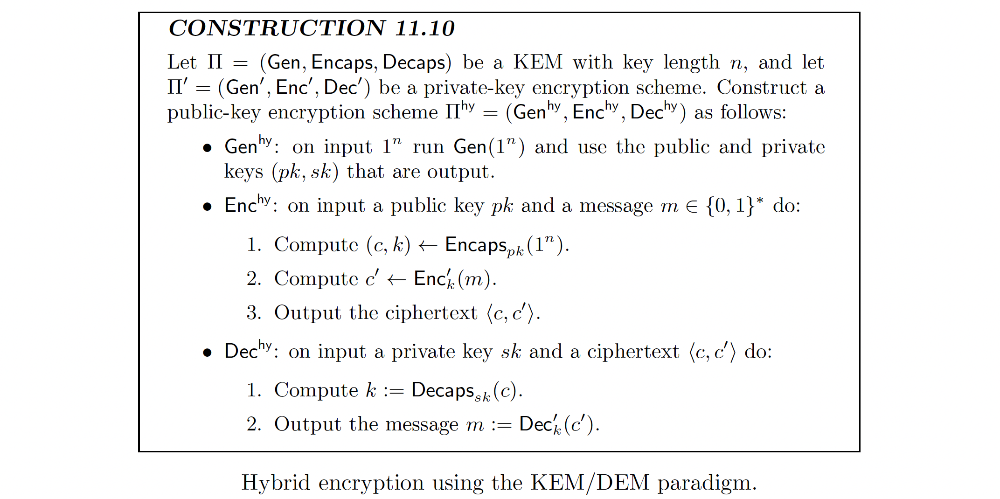

# 😈 READ ME!

This folder is to construct hybrid encryption with the KEM (Key Encapsulation Mechanism) paradigm using [liboqs-python](https://github.com/open-quantum-safe/liboqs-python). This README file is organized as follows:

- [KEM Illustrations](#kem-illustrations)
- [Requirements](#requirements)
- [High level goal](#high-level-goal)

## 🕹 KEM Illustrations


<!-- The key pair generation are run only once, and we assume that the secret key is stored securely by the receiver. -->
<!-- We assume that the channel is unsafe. -->
<!-- Suppose that if there is no EMS and we directly transmit the key, then this key may be intercepted and be used to decrypt the message. -->
<!-- Thus, KEM is introduced. In this case, only the ciphertext is transmitted (assuming that the secret key is pre-saved by the receiver). -->
<!-- Even if the attacker intercepts the ciphertext, he will not be able to guess even a bit for the key, which is used to encode the message. -->

## 🕹 High-Level Goal
### Privacy Protection on Blockchain
```python
# Relationship of private key and address
hash(hash(fun(private_key🔑))) -> address🏠

# Encryption for the transaction
hash({'payer address': payer_address🏠,
      'receiver address': receiver_address🏠,
      'amount': '0.1liu'})   
-> transaction_info🧾

# Sign the transaction info
sign(transaction_info🧾, private_key🔑) -> signature🖍

# Verify the signature
verify(signature🖍, receiver_address🏠) -> transaction_info🧾
```
```python
# Encrypt and decrypt by PQC
# We obtain the ciphertext by KEM
public_key💉, secrete_key🧬 = KEM.generate_keypair()
ciphertext📜, key💊 = KEM.encapsulate(public_key💉)

# Notice that all symmetric encryption is quantum safe
# User will hold a PQC ciphertext encrypted key which we provide
encrypt_symmetric(private_key🔑, key💊) = private_key_encrypted🔐

# We can convert the user-hold key to the private key by the ciphertext
key💊 = KEM.decapsulate(secret_key🧬, ciphertext📜)
decrypt_symmetric(private_key_encrypted🔐, key💊) = private_key🔑
```

## 🕹 Requirements
```bash
web3==5.30.0
ecdsa==0.18.0
joblib==0.14.1
cryptography==37.0.4
liboqs-python==0.7.2  # see instructions below
```
### Installation for `liboqs-python`
The following commands are tested on MacOS Catalina with Python 3.8.
```bash
# Build liboqs from source
>>> cd ~
>>> brew install cmake ninja openssl@1.1 wget doxygen graphviz astyle valgrind
>>> pip install pytest pytest-xdist pyyaml nose nose2 rednose
>>> git clone -b main https://github.com/open-quantum-safe/liboqs.git
>>> cd liboqs && mkdir build && cd build
>>> cmake -GNinja .. -DBUILD_SHARED_LIBS=ON
>>> ninja
>>> sudo ninja install
>>> export LD_LIBRARY_PATH=$LD_LIBRARY_PATH:/usr/local/lib

# Build the Python wrapper
>>> cd ~ && git clone git@github.com:open-quantum-safe/liboqs-python.git
>>> cd ~/liboqs-python
>>> python setup.py install
>>> export PYTHONPATH=~/liboqs-python

# Check if the installation is successful
>>> python tests/test_sig.py
```

## 🕹 References
[1] Katz, Jonathan, and Yehuda Lindell. [*Introduction to Modern Cryptography*](http://library.lol/main/E59B838EB90F79A638831BEDCEAA5179). CRC press, 2020.
